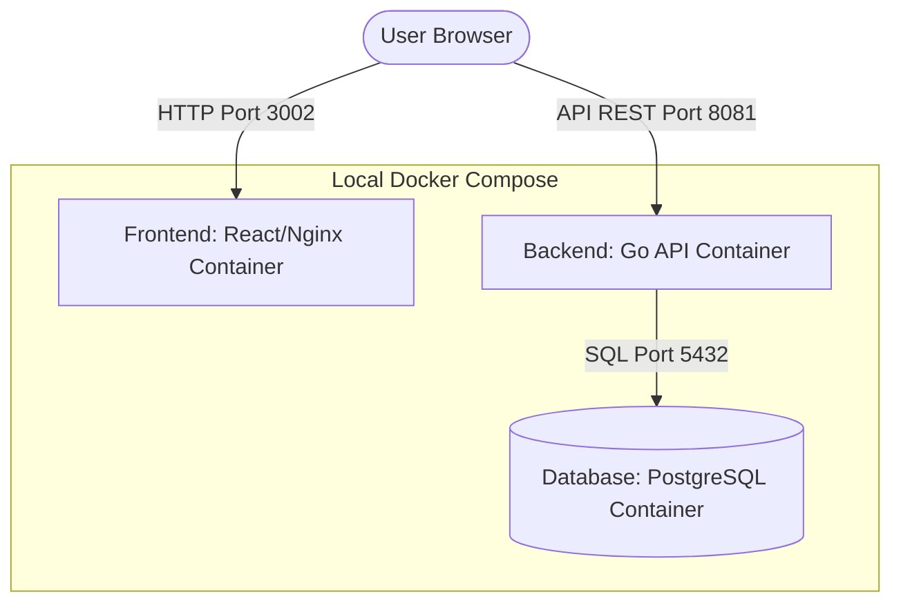

# 3-Tier Enterprise Task Cloud (React + Go + PostgreSQL)

This is a modern, high-performance 3-tier task management application designed for containerized development and deployment on Amazon EKS or local environments. 

## Application Architecture

The application is structured into three decoupled tiers:

1. **Frontend (Presentation)**: Built with **React** and **Vite**, styled using a sleek, modern glassmorphic dark-theme design. Served through **Nginx** in production.
2. **Backend (Application Logic)**: A high-throughput API gateway written in **Go**, exposing REST endpoints, managing database connection pooling, auto-running migrations, and supporting CORS middleware.
3. **Database (Data Storage)**: A **PostgreSQL** relational database using a persistent volume mount to store task information securely.



---

## Folder Structure

```text
eks-3-tier-project/
├── docker-compose.yml       # Docker Compose orchestrator
├── README.md                # Documentation
├── backend/                 # Go Backend API Service
│   ├── Dockerfile
│   ├── go.mod
│   ├── go.sum
│   ├── cmd/
│   │   ├── backend/
│   │   │   └── main.go
│   │   └── migrate/
│   │       └── main.go
│   └── internal/
│       └── db/
│           ├── connect.go
│           └── migrate.go
├── frontend/                # React Frontend Service
│   ├── Dockerfile
│   ├── nginx.conf           # Nginx Configuration
│   ├── package.json
│   ├── vite.config.js
│   ├── index.html
│   └── src/
│       ├── main.jsx
│       ├── App.jsx
│       └── index.css        # Rich custom CSS design system
└── k8s/                     # Kubernetes Manifests for EKS
    ├── postgres.yaml
    ├── backend.yaml
    ├── frontend.yaml
    └── migration-job.yaml
```

---

## Getting Started: Local Development (Docker Compose)

Ensure you have [Docker](https://docs.docker.com/get-docker/) installed.

### 1. Build and Start the Application

From the root directory (`eks-3-tier-project`), run the following command to build and launch all containers in background:

```bash
docker compose up --build -d
```

### 2. Verify Running Services

Check the container status:

```bash
docker compose ps
```

You should see three containers running:
- `eks-3tier-frontend` (Port `3002`)
- `eks-3tier-backend` (Port `8081`)
- `eks-3tier-db` (Port `5432`)

### 3. Accessing the Tiers

- **React Frontend**: Open [http://localhost:3002](http://localhost:3002) in your browser.
- **Go API Healthcheck**: Access [http://localhost:8081/api/health](http://localhost:8081/api/health).
- **Go API Tasks**: Access [http://localhost:8081/api/tasks](http://localhost:8081/api/tasks).

### 4. Cleaning Up

To stop all services and delete the PostgreSQL persistent data volume:

```bash
docker compose down -v
```

---

## API Endpoints Reference

The Go backend exposes the following RESTful API endpoints:

| Endpoint | Method | Description |
| :--- | :--- | :--- |
| `/api/health` | `GET` | Database connectivity & status ping |
| `/api/tasks` | `GET` | Fetch all tasks from PostgreSQL |
| `/api/tasks` | `POST` | Create a new task (JSON payload required) |
| `/api/tasks/<id>` | `PUT` | Update details or toggle task completion status |
| `/api/tasks/<id>` | `DELETE` | Remove a task permanently from the database |

---

## Deploying to AWS EKS (Kubernetes)

We have provided native Kubernetes manifests under the `k8s/` directory.

### 1. Build & Push Images to ECR (Amazon Elastic Container Registry)

Create ECR repositories in your AWS account and push the built images:

```bash
# Login to AWS ECR
aws ecr get-login-password --region <region> | docker login --username AWS --password-stdin <aws_account_id>.dkr.ecr.<region>.amazonaws.com

# Tag images
docker tag eks-3-tier-project-frontend:latest <aws_account_id>.dkr.ecr.<region>.amazonaws.com/eks-3tier-frontend:latest
docker tag eks-3-tier-project-backend:latest <aws_account_id>.dkr.ecr.<region>.amazonaws.com/eks-3tier-backend:latest

# Push images
docker push <aws_account_id>.dkr.ecr.<region>.amazonaws.com/eks-3tier-frontend:latest
docker push <aws_account_id>.dkr.ecr.<region>.amazonaws.com/eks-3tier-backend:latest
```

### 2. Update Manifests

Open `k8s/frontend.yaml` and `k8s/backend.yaml`, then replace the image placeholders with your pushed ECR repository URIs:
- `image: <aws_account_id>.dkr.ecr.<region>.amazonaws.com/eks-3tier-backend:latest`
- `image: <aws_account_id>.dkr.ecr.<region>.amazonaws.com/eks-3tier-frontend:latest`

### 3. Deploy using Helm (Recommended)

You can deploy the entire 3-tier application stack with the unified Helm chart located in `helm/eks-3-tier-app`:

```bash
# Create the production namespace (if not exists)
kubectl create namespace production

# Install the Helm chart
helm install eks-3-tier-app ./helm/eks-3-tier-app --namespace production
```

To customize parameters such as database settings, AWS Secrets Manager secrets, or replica counts, update `helm/eks-3-tier-app/values.yaml` or use `--set`:
```bash
# Example: Disable in-cluster PostgreSQL to use an external RDS instance
helm install eks-3-tier-app ./helm/eks-3-tier-app \
  --namespace production \
  --set postgres.enabled=false \
  --set databaseSecret.secretData.dbHost="your-rds-endpoint.amazonaws.com"
```

### 4. Deploy using raw Manifests (Alternative)

Connect to your AWS EKS cluster and apply the raw manifests:

```bash
kubectl apply -f k8s/
```

### 5. Verify Deployments & Expose URL

Monitor the status of pods and services:

```bash
kubectl get pods -n production -w
kubectl get svc -n production
```

AWS ALB Controller will dynamically provision an Application Load Balancer based on the Ingress rules. Navigate to the host address configured (e.g., `app.mryash7803.online`) or verify the endpoint routes.

---

## 📊 Monitoring & Observability (Loki + Promtail + Grafana)

The project includes an integrated log aggregation stack using Grafana Loki and Promtail.

### 1. View Logs in Grafana
Access your Grafana visualization dashboard by port-forwarding:
```bash
kubectl port-forward -n monitoring svc/monitoring-grafana 3000:80
```
- **URL**: [http://localhost:3000](http://localhost:3000)
- **Username**: `admin`
- **Password**: `BINNiiBxsWT4y7Nz83oO2bFGYgrtOpd9N6kXTdUt`

### 2. Pre-configured Dashboard
We have imported a custom dashboard named **"3-Tier Application Logs (Loki)"** which displays:
- **Log Rate by Application**: Visual comparison of backend and frontend logs over time.
- **Total Errors**: Aggregated error and warning counts in the last 1 hour.
- **Service Logs**: Raw, search-enabled logs for both the `backend` and `frontend` microservices.

### 3. LogQL Queries (Explore Tab)
You can query logs manually inside the Grafana Explore page using **Loki** as the data source:
- Fetch all backend logs: `{app="backend"}`
- Filter backend logs containing "error": `{app="backend"} |= "error"`
- Expose rate of backend logs: `sum(count_over_time({app="backend"}[5m]))`

---

## ⚙️ Autoscaling Architecture & Choices

Cluster Autoscaler was chosen for this project because it integrates cleanly with EKS managed node groups. Karpenter is a newer alternative that offers more advanced provisioning and cost optimization, but Cluster Autoscaler was selected to demonstrate the classic autoscaling architecture.

